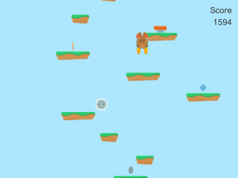
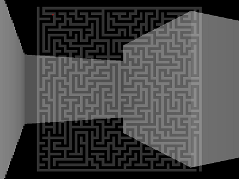

## Slot

**NEW**: [Improved version](http://agilul.github.io/slot-phaser/) with [Phaser](http://phaser.io/).

A simple slot machine HTML5 game. [Try it](https://agilul.github.io/slotmachine/) in your browser.

[Source code](https://github.com/agilul/slotmachine).

## Audio Visualization

An audio visualizer with FFT analysis and shader rendering.

Written in C++ with [SFML](http://www.sfml-dev.org/) and GLSL. The shader uses a ray marching algorithm to render geometric primitives.

[[Source](https://github.com/agilul/audio-visualization), [YouTube](https://www.youtube.com/watch?v=bYk8sEuPvlk)]

## Game of Life

An implementation of Conway's Game of Life in OpenGL Shading Language.

[[Source](https://github.com/agilul/game-of-life), [Shadertoy](https://www.shadertoy.com/view/XdtXRX)]

## Jumper

A simple jumper game with powerups and enemies.

Made with [Unity3D](https://unity3d.com/).

[[Source](https://github.com/agilul/jumper-unity3d), [GIF](images/jumper.gif)]

## Love2D Demos

All demos are written in Lua with [LÖVE](https://love2d.org/) 0.10.1.

### Raycaster in a maze

A simulated 3D environment with raycasting in a 2D randomly generated maze.
Using a fixed number of raycasts it determines the distance of walls from the player and draws them accordingly.

The maze is generated with the recursive backtracking algorithm and then converted to a format suitable for the renderer.

The raycaster subsystem is a partial port from http://www.playfuljs.com/a-first-person-engine-in-265-lines/

[[Source](https://github.com/agilul/raycaster-maze-love2d), [GIF](images/raycaster.gif)]

### Software Renderer

A simple 3D renderer for a set of points using transformation matrices and perspective projection.
It doesn't use OpenGL functions, instead it calculates through matrix operations the final positions of 3D vertices to a 2D scene.

[[Source](https://github.com/agilul/software-renderer-love2d), [GIF](images/renderer.gif)]

### Space Shooter

A top-down space shooter with physics and dynamic steering behaviours.
It uses simple physics integration with movement governed by AI modifying linear and angular accelerations.

Helper libraries in lib/ from http://hump.readthedocs.org/en/latest/

[[Source](https://github.com/agilul/spaceshooter-love2d), [GIF](images/spaceshooter.gif)]